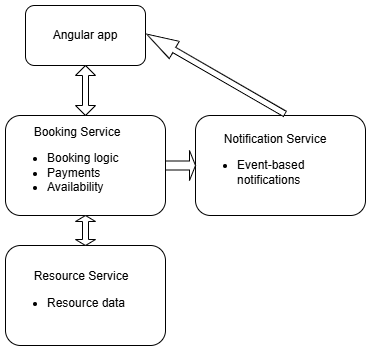

# Smart Resource Management Platform

## Overview

The **Smart Resource Management Platform** is a distributed, containerized system that allows users to **discover, book, and pay for resources** within a specified time window.

The platform follows a **microservices architecture**, where each service owns its data and responsibilities and communicates via REST APIs.  
It focuses on **availability-based resource selection**, **booking lifecycle management**, and **payment orchestration** using **:contentReference[oaicite:0]{index=0}**.

---

## System Architecture

The backend consists of **three independent Spring Boot microservices**, each running in its own Docker container and backed by its own PostgreSQL database.


---

## Microservices Overview

### Booking Service

**Responsibilities**
- Booking lifecycle management
- Resource availability checks
- Payment orchestration
- Stripe integration
- Booking and payment persistence

**Booking Status Flow**

PENDING_CONFIRMATION &rarr; PAYMENT_PENDING &rarr; CONFIRMED | FAILED

**Payment Status Flow**

AWAITING_CUSTOMER_ACTION &rarr; PENDING &rarr; SUCCESS | PAYMENT_FAILED

---

### Resource Service

**Responsibilities**
- Resource catalog management
- Resource metadata storage
- Responding to resource queries

The Resource Service provides the **complete list of resources**.  
Availability filtering is performed by the **Booking Service**, which queries its own booking data to determine conflicts within a given time range.

---

### Notification Service

**Responsibilities**
- Receiving booking-related events
- Sending notifications (extensible design)

This service is decoupled to allow future asynchronous or event-driven communication.

---

## End-to-End Booking & Payment Flow

### 1. User Login
The user authenticates through the Angular frontend and gains access to the booking interface.

---

### 2. Resource Availability Search
1. User selects **start date** and **end date**
2. Frontend sends a POST request to the **Booking Service**
3. Booking Service:
    - Requests all resources from the **Resource Service**
    - Queries its own booking repository
    - Filters out unavailable resources for the selected time period
4. Frontend displays **only available resources**

---

### 3. Booking Creation (Pre-Payment)
1. User selects a resource
2. Frontend calculates the **total price**
3. Booking Service:
    - Creates a booking with status `PENDING_CONFIRMATION`
    - Creates a payment with status `AWAITING_CUSTOMER_ACTION`
4. User reviews the booking summary before payment

---

### 4. Payment Processing
1. User selects a payment method (Card / PayPal)
2. `stripe.js` validates payment details client-side
3. Frontend sends a payment request to the Booking Service
4. Booking Service:
    - Creates a Stripe PaymentIntent
    - Updates booking and payment status to `PAYMENT_PENDING` / `PENDING`

---

### 5. Payment Confirmation (Webhook)
1. Stripe sends an event to: /webhooks/stripe
2. Booking Service verifies the PaymentIntent ID
3. Final state update:
- **Success**
    - `booking.status = CONFIRMED`
    - `payment.status = SUCCESS`
- **Failure**
    - `booking.status = FAILED`
    - `payment.status = PAYMENT_FAILED`

---

### 6. Booking History
All bookings (confirmed or failed) are visible to the user under a dedicated **Booking History** tab.

---

## Dockerized Setup

The entire platform can be started using **Docker Compose**.

**Included Services**
- Booking Service + PostgreSQL
- Resource Service + PostgreSQL
- Notification Service + PostgreSQL
- Angular Frontend

Each service uses its own database and persistent volume.

---

## Design Decisions & Trade-offs

- Database-per-service to enforce service boundaries
- Synchronous REST communication for simplicity
- Availability logic centralized in Booking Service
- Webhook-based payment confirmation
- Stateless services for scalability

---

## Future Improvements

- Event-driven communication (message broker)
- API Gateway
- Distributed tracing and metrics
- Idempotent booking creation
- Cloud-native deployment (Kubernetes / ECS)

---

## Why This Project Matters

This project demonstrates:
- Real microservices boundaries
- Distributed transaction handling
- Payment lifecycle management
- Webhook-based event processing
- Production-oriented backend design

---

## Getting Started

### Prerequisites
- Docker & Docker Compose
- Node.js
- Java 17+

### Run the Application
```bash
docker-compose up --build

