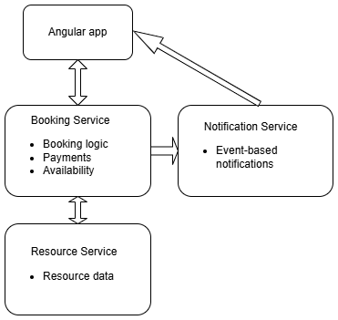
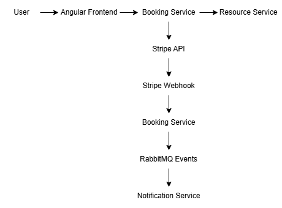

# Smart Resource Management Platform

## Overview

The **Smart Resource Management Platform** is a distributed, containerized system that allows users to **discover, book, and pay for resources** within a specified time window.

The platform follows a **microservices architecture**, where each service owns its data and responsibilities and communicates via **REST APIs** and **RabbitMQ**.  
It focuses on **availability-based resource selection**, **booking lifecycle management**, and **payment orchestration** using **Stripe**.

---

## System Architecture

The backend consists of **three independent Spring Boot microservices**, each running in its own Docker container and backed by its own PostgreSQL database.

---

## Microservices Overview

### Booking Service

**Responsibilities**
- Booking lifecycle management
- Fetching resources from the Resource Service using **Spring WebClient**
- Resource availability checks
- Payment orchestration
- **Stripe integration**
- Booking and payment persistence
- Sending booking, payment and refund events to **RabbitMQ**
- Running asynchronous refund retry mechanisms
- Streaming refund updates to the frontend via **Server-Sent Events (SSE)**, allowing users to see refund status updates in real time in the **My Bookings** view.

**Booking Status Flow**

PENDING_CONFIRMATION &rarr; PAYMENT_PENDING &rarr; CONFIRMED | FAILED

**Payment Status Flow**

AWAITING_CUSTOMER_ACTION &rarr; PENDING &rarr; SUCCESS | PAYMENT_FAILED

---

### Resource Service

**Responsibilities**
- Resource catalog management
- Resource metadata storage
- Responding to resource queries from the Booking Service

The Resource Service provides the **complete list of resources**.  
Availability filtering is performed by the **Booking Service**, which queries its own booking data to determine conflicts within a given time range.

---

### Notification Service

**Responsibilities**
- Receiving booking, payment, and refund events via **RabbitMQ**
- Sending email notifications to users
- Persisting a copy of each sent email in the database

This service is decoupled to allow future asynchronous or event-driven communication.

**Email Persistence**

Every email attempt is stored in the database with a status:

- **PENDING** – email queued for sending
- **SENT** – email successfully sent
- **FAILED** – email failed after all retries
- **RETRYING** – email is currently being retried

Each email record is updated throughout its lifecycle to reflect its current state.

**Retry Mechanism**

- If an email fails during sending (e.g., RabbitMQ consumer processing failure):
    - The service retries sending the email up to **3 attempts**
    - During retry attempts, the status is set to **RETRYING**
    - Each attempt result is recorded and persisted
    - After **3 failed attempts**, the status is updated to **FAILED**
- Status updates are saved to the database after each attempt

**Scheduled Retry Processing**

- A background scheduler runs every **5 minutes**
- It scans the database for emails with status **RETRYING**
- Attempts to resend those emails
- Updates the email status based on the outcome of each retry

## End-to-End Booking & Payment Flow

### 1. User Login
The user authenticates through the Angular frontend using a username and password. Upon successful authentication, the server issues an **HTTP-only session cookie** to maintain the user's session. This cookie is secured with the `HttpOnly` and `Secure` flags to prevent cross-site scripting (XSS) attacks and ensure transmission over HTTPS only. The session remains active until it naturally expires based on the configured session timeout. Once the session expires, the user is automatically logged out, and subsequent requests require re-authentication.

---

### 2. Resource Availability Search
1. The user navigates to the **Resources** page where all resources are listed with their **base price** and **price unit**.
2. By clicking the **Create a booking** button, the user is redirected to the **New Booking** page.
3. User selects **start date** and **end date**
4. Frontend sends a POST request to the **Booking Service**
5. The Booking Service:
    - Requests all resources from the **Resource Service**
    - Queries its own booking repository
    - Filters out unavailable resources for the selected time period
6. Frontend displays **only available resources**

---

### 3. Booking Creation (Pre-Payment)
1. User selects one or several resources
2. Backend calculates the **total price** everytime a resource is selected and show to frontend
3. The Booking Service:
       - Creates a booking with `booking.status = PENDING_CONFIRMATION` and `modification.status = NONE`
       - Creates a payment with status `AWAITING_CUSTOMER_ACTION`

---

### 4. Payment Processing
1. User selects a payment method (Card / PayPal)
2. `stripe.js` validates payment details client-side
3. Frontend sends a payment request to the Booking Service
4. The Booking Service:
    - Creates a Stripe PaymentIntent
    - Updates payment status to `PROCESSING`
5. If user doesn't select any payment or no payment request has been sent within 15 minutes (a scheduler is set to scan pending bookings every minute):
    - `booking.status = EXPIRED`

---

### 5. Payment Confirmation (Webhook)
1. Stripe sends an event to: /webhooks/stripe
2. Booking Service verifies the PaymentIntent ID
3. Final state update:
- **Success**
    - `booking.status = CONFIRMED`
    - `payment.status = SUCCEEDED`
    - A `BOOKING_CANCEL_FAILED` event is published to RabbitMQ
- **Failure**
    - `booking.status = PAYMENT_FAILED`
    - `payment.status = FAILED`
    - A `BOOKING_FAILED` event is published to RabbitMQ
---

### 6. Booking History
All bookings (confirmed or failed) are visible to the user under ** My Bookings** tab.

---

## Booking Modification

The modification process is implemented as a new booking combined with a refund of the original payment, ensuring that booking records remain immutable and auditable.
    
### 1. Modification Request (Pre-Payment)
1. Under the ** My Bookings** tab, the user clicks the **edit icon** next to the booking they want to modify.
2. The app navigate to the **New Booking** page

---

### 2. New Booking Creation
1. A message indicating that the user is modifying an existing booking is displayed.
2. User selects **start date**, **end date**, and **resources**
3. The backend recalculates the total price based on the new selection.
4. The Booking Service:
    - Sends a refund request to Stripe for the original booking and sets the payment status to `REFUND_PENDING`
    - Creates a new booking with status `PENDING_CONFIRMATION`
    - Creates a new payment record with status `AWAITING_CUSTOMER_ACTION`

---

### 3. Payment Processing
The process is identical to the payment flow in the new booking workflow.

---

### 4. Payment Confirmation
The process is identical to the payment confirmation step in the new booking workflow.

---

### 5. Refund Confirmation (Webhook)
1. Stripe sends an event to: /webhooks/stripe
2. Booking Service verifies the Charge ID
3. The final refund state is updated.
- **Success**
    - `modification.status = MODIFIED`
    - `payment.status = REFUNDED`
    - A `BOOKING_MODIFIED` event is published to RabbitMQ
- **Failure**
    - `modification.status = MODIFY_FAILED`
    - `payment.status = REFUND_FAILED`
    - A `BOOKING_MODIFY_FAILED` event is published to RabbitMQ

---

## Booking Cancellation

Cancellation events are published through RabbitMQ to ensure that downstream services (such as the Notification Service) can react asynchronously.

1. Under the ** My Bookings** tab, the user clicks the **cancel icon** next to the booking they want to cancel.
2. The Booking Service processes the cancellation request.
- **If the cancellation is successful**
    - `booking.status = CANCELED`
    - A `BOOKING_CANCELED` event is published to RabbitMQ
- **If the cancellation fails:**
    - `booking.status = CONFIRMED`
    - A `BOOKING_CANCEL_FAILED` event is published to RabbitMQ
---

## Resilience & Failure Handling

The platform includes several mechanisms to ensure **reliability, consistency, and fault tolerance** in a distributed environment.

### Stripe Webhook Reliability

Payment confirmation does not rely solely on frontend responses.
Instead, the system uses **Stripe webhooks** to receive the final payment result.

This ensures that booking states are updated correctly even if:

* the user closes the browser
* the frontend loses connection
* a network interruption occurs during payment

Webhook events are verified using the **Stripe signature** before being processed.

---

### Asynchronous Refund Retry Mechanism

Refund requests may occasionally fail due to:

* temporary Stripe API issues
* network interruptions
* transient system errors

To handle this, the Booking Service implements an **asynchronous retry mechanism**:

1. Failed refunds are marked with status `REFUND_FAILED`
2. A background task periodically retries these refunds
3. The frontend receives updates via **Server-Sent Events (SSE)**

This ensures that refund operations eventually reach a **consistent final state**.

---

### Event-Driven Notifications

The system uses **RabbitMQ** to publish events related to:

* booking creation
* payment success or failure
* refund success or failure

These events are consumed by the **Notification Service**, which sends email notifications to users.

This **event-driven approach** provides several advantages:

* loose coupling between services
* improved scalability
* easier extension for additional notification channels (e.g., SMS, push notifications)

---

## Dockerized Setup (Local Development Only)

The entire platform can be started using **Docker Compose**.

**Included Services**
- Booking Service + PostgreSQL
- Resource Service + PostgreSQL
- Notification Service + PostgreSQL
- Angular Frontend

Each service uses its own database and persistent volume.

---

## Deployment Architecture

### Frontend
- Hosted on **Vercel**
- Each push to the frontend repository triggers an automatic **Vercel build and deployment**
- The frontend communicates with backend services via public HTTPS endpoints

---

### Backend Services

**Deployment Platform:**
- All backend services are containerized and deployed on **Google Cloud Run**

**CI/CD Pipeline:**
- Each push to backend repositories triggers **GitHub Actions**
- GitHub Actions:
    - Builds Docker images for each service
    - Pushes the images to **Google Artifact Registry**
- **Cloud Run** pulls and deploys the services from Artifact Registry

**Communication:**
- Services communicate via REST (synchronous) and **RabbitMQ** (asynchronous messaging)

---

### Databases

- **Booking DB** → hosted on **Supabase**
- **Resource DB** → hosted on **Supabase**
- **Notification DB** → hosted on **Aiven**

Each service connects to its respective database using environment variables.

---

### Message Broker

- **RabbitMQ** hosted on **CloudAMQP**
- Used for event-driven communication between booking and notification services:
    - Booking events (confirmation, mofification, cancellation)

---

### Configuration

- All external connections are configured via **environment variables** in Cloud Run:
    - Database connection strings
    - RabbitMQ connection (host, port, username, password)
    - External API keys (e.g., Stripe)

---

### Deployment Flow Summary

1. Developer pushes changes to frontend → Vercel automatically builds and deploys
2. Developer pushes changes to backend service:
    - GitHub Actions builds Docker image
    - Image is pushed to Google Artifact Registry
    - Cloud Run deploys the updated container
3. Services connect to:
    - Databases (Supabase, Aiven)
    - RabbitMQ (Aiven)
      via environment variables

---

## Design Decisions & Trade-offs

- Database-per-service architecture to enforce clear service boundaries
- Hybrid communication model: synchronous REST for service queries and RabbitMQ for event-driven messaging
- Availability logic centralized in the Booking Service to avoid cross-service booking conflicts
- Webhook-based payment confirmation to ensure reliable payment state updates

---
## Future Improvements

The business rules implemented in the platform are designed to be adaptable.

---

## Architecture Highlights

This project demonstrates several backend engineering concepts:

- Microservice boundaries with database-per-service architecture
- Hybrid communication using REST and RabbitMQ
- Booking and payment lifecycle management
- Webhook-based event processing with Stripe
- Asynchronous event-driven notifications

